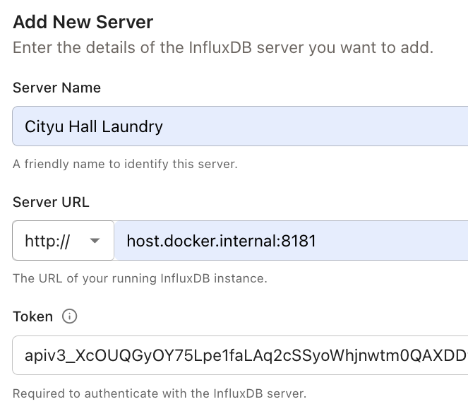
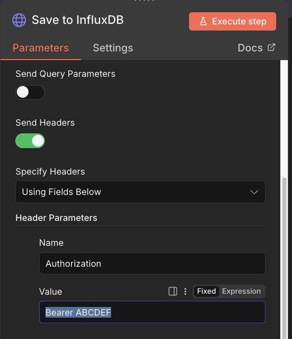

# CityU-Hall-Laundry-Stats

This repository:
1. Deploys n8n to fetch the CityU laundry status and stores it in MongoDB
2. Visualizes the data with Grafana

> [!TIP]
> The dashboard is not implemented yet! Feel free to contribute!

## Installation

### Prerequisites

- Docker

### Config InfluxDB 

1. Create an operator token

Run this command to get the admin token. [ref](https://docs.influxdata.com/influxdb3/core/get-started/setup/?t=Docker#create-an-operator-token)

```
docker exec -it influxdb3-core influxdb3 create token --admin
```

2. Conect the influx core with explorer at [http://localhost:8888/](http://localhost:8888/)

3. Add new server with the token you generated


4. Manage Databases > Create New

- Database Name: `cityu_laundry_db`

### Config n8n

1. Initialize your n8n account at [http://localhost:5679](http://localhost:5679)

   - Initialize your n8n account
   - Import the workflows and credentials:

2. Import the workflow

```bash
make init-n8n
```

3. Replace your InfluxDB token in the `Save to InfluxDB` node



2. Activate the workflow in the n8n Web UI

> [!NOTE]
> The default trigger interval is 1 minute. Edit it if you want to save resources.

## Remove All Data

> [!WARNING]
> **Warning:** This command removes the containers and volumes (including all data in MongoDB).

```bash
make clear-env
```
